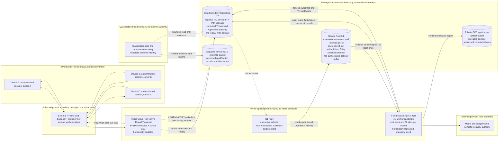

# Current OpenPoke v1 demo architecture

Status: current selected topology on 2026-08-07. Production qualification is
still `MISSING`.



## Boundary legend

| Boundary | Contract |
| --- | --- |
| Trust | Every command and stream authenticates one Principal. Unknown and unauthorized Threads are indistinguishable. Provider responses are normalized before they cross into durable state. |
| Data | Regional-HA Cloud SQL for PostgreSQL in `us-east4` is the only canonical Thread and AgentRun authority and is reached by private IP with IAM database authentication. Pub/Sub follows the `us-east4` environment policy, carries identities rather than lifecycle state, and retains unacknowledged delivery for seven days. Private GCS application artifacts and versioned qualification evidence are separate storage roles. |
| Storage | The `us-east4` application-artifact bucket accepts content-addressed immutable bytes only after digest and length verification. Qualification jobs write checksummed records to a separate private, versioned evidence bucket; those records never become runtime authority. |
| Singleton | PostgreSQL has one logical write authority. The N1 relay has one active Principal-first selector. Neither role is hidden inside a web instance. |
| Horizontal scale | Edge and Native Thread Transport instances scale horizontally. StreamingPull workers are replicated, but the current fleet is fixed and manually sized so recovery does not depend on metric-triggered autoscaling. |

## Ordered calls

```text
authenticated HTTP command
  -> PostgreSQL transaction
       -> Acceptance Receipt, UserMessageAppended, AgentRun, capacity, outbox
  -> N1 relay selects a fair bounded window
  -> one ordered Pub/Sub subscription
  -> fixed StreamingPull worker point-claims PostgreSQL authority
  -> model or tool attempt runs outside the transaction
  -> fenced outcome and durable ThreadEvents commit
  -> Native Thread Transport replays after each device cursor
  -> live SSE follows the replay-to-live cut
```

Delivery is at least once. Authority is exactly one committed outcome under the
current claim epoch. A duplicate or out-of-order Pub/Sub delivery cannot create
new authority. A missed PostgreSQL notification can delay a wake, but the
safety recheck repairs it from canonical history.
