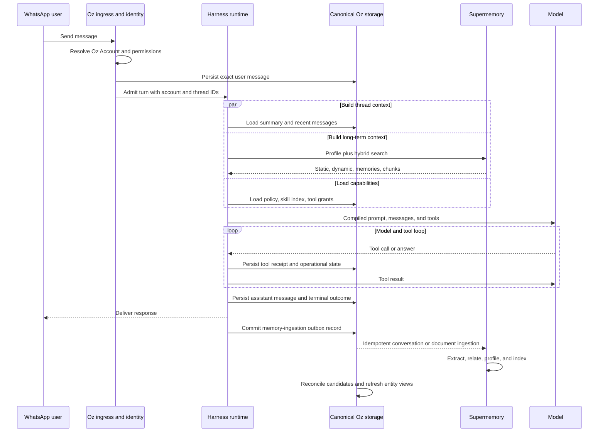

# Oz end-to-end memory lifecycle options

Research date: 2026-08-08

Source policy: official Cloudflare, LangChain, LangGraph, LangSmith,
Supermemory, and GBrain documentation and source

Access date for every external source: 2026-08-08

## Executive answer

The **Oz Memory System** includes context-window construction, conversation
state, compaction, long-term knowledge, retrieval, and maintenance. The **Oz
Knowledge Base** is only the durable long-term portion. The model's context
window is a temporary compiled view of the memory system. It is not itself the
knowledge base.

```text
Oz Memory System
├── Prompt and Context Plane        temporary, one model call
├── Thread Memory                   messages, tool results, summaries
├── Oz Knowledge Base              durable evidence and structured knowledge
├── Retrieval and Projection Plane Supermemory and generated views
└── Maintenance and Governance     extraction, correction, deletion, export
```

Compaction belongs to Thread Memory. A compaction summary is a lossy projection
used to keep a conversation inside the context window. It does not become a
durable fact merely because it was placed in the prompt. Important facts are
separately extracted into the Knowledge Base with evidence and provenance.

The same product boundary should survive either foundation:

- Oz owns the account, source messages, files, structured memory ledger,
  correction and deletion semantics, entity schema, and generated views.
- The selected harness owns its model and tool loop, short-term thread state,
  checkpointing, and context compaction.
- Supermemory provides derived extraction, profiles, hybrid retrieval, and a
  memory graph. It is not the sole canonical database.
- Supermemory should be called through a typed Oz adapter in the normal hot
  path. MCP is useful as an optional interoperability surface, not as the
  internal database protocol.

## The full memory model

### 1. Prompt and Context Plane

This is the exact input compiled for one model call:

1. Oz identity and non-negotiable product policy.
2. Runtime identity, permissions, account tier, timezone, and channel policy.
3. A small Core Profile containing stable and currently useful user context.
4. The current thread summary and the recent uncompressed message tail.
5. Query-relevant memories, source excerpts, and entity views.
6. Skill names and descriptions, followed by the full content of only selected
   skills.
7. Tool schemas for Oz tools, connected applications, and approved MCP tools.
8. The current user message and any in-turn tool results.

The context is rebuilt or updated on every turn. LangChain explicitly calls
model context transient and distinguishes it from persistent state and store
data. Its model context consists of instructions, message history, tools, model,
and response format. [LangChain context engineering](https://docs.langchain.com/oss/javascript/langchain/context-engineering)

Cloudflare's Session API makes the same separation. It stores conversation
history independently from persistent context blocks, then assembles read-only,
writable, searchable, and loadable blocks into the system prompt.
[Cloudflare conversation state and memory](https://developers.cloudflare.com/agents/concepts/conversation-state-and-memory/)

### 2. Thread Memory

Thread Memory answers, "What has happened in this conversation and what is the
agent currently doing?" It contains:

- user, assistant, and tool messages;
- tool-call results and approval state;
- current task or run state;
- a rolling conversation summary;
- recent messages kept verbatim after compaction.

It is durable enough to resume a conversation, but it is scoped to one thread.
It must not be treated as the cross-thread personal Knowledge Base.

### 3. Oz Knowledge Base

The Knowledge Base is the durable, cross-thread memory product visible to the
user. It has three canonical layers:

```text
Evidence
  exact WhatsApp messages, emails, files, documents, and tool receipts
        |
        v
Memory ledger
  facts, preferences, events, instructions, relationships, corrections
        |
        v
Entity views
  people, organizations, projects, places, topics, and user-readable pages
```

The Evidence layer is immutable except for explicit retention or deletion. The
Memory Ledger contains individually addressable claims linked to evidence. An
Entity View is a compiled current-state page plus a provenance timeline. It is
rebuildable from evidence and the ledger.

This takes the strongest GBrain ideas without copying its complete
implementation. GBrain's recommended schema describes an entity registry,
immutable event ledger, fact store with provenance, and typed relationship
graph. It treats the compiled page as a generated view of structured facts and
events. [GBrain recommended schema](https://github.com/garrytan/gbrain/blob/0b47afbf402a4e27a648bb9d131ce584461461ea/docs/GBRAIN_RECOMMENDED_SCHEMA.md)

### 4. Retrieval and Projection Plane

Supermemory receives copies of eligible evidence and structured memories. It
produces:

- static profile facts;
- dynamic recent context;
- extracted memories;
- raw document chunks;
- semantic and hybrid search results;
- graph relationships and retrieval paths.

The current TypeScript SDK can add content, retrieve a static and dynamic
profile, search by container tag, filter by metadata, and delete documents.
[Supermemory TypeScript SDK](https://supermemory.ai/docs/integrations/supermemory-sdk)
The v4 search surface can search memories, documents, or both in hybrid mode.
[Supermemory API changelog](https://supermemory.ai/changelog/api/)

Supermemory is rebuildable because Oz retains stable source IDs, source
content, and ledger records. If Supermemory is unavailable, Oz can still
continue with the Core Profile and recent thread state, then reconcile the
index later.

### 5. Memory Schema Pack

A schema pack is configuration, not memory data. It defines:

- permitted entity and memory types;
- required metadata and evidence rules;
- path or view conventions;
- allowed relationship verbs;
- extraction and enrichment policy;
- rules for resolving ambiguous entities.

GBrain's schema pack is an always-consulted runtime artifact defining page
types, path prefixes, link verbs, extractability, enrichment, and filing rules.
It can be composed and versioned. [GBrain schema packs](https://github.com/garrytan/gbrain/blob/0b47afbf402a4e27a648bb9d131ce584461461ea/docs/architecture/schema-packs.md)

Oz v1 should ship one small, versioned default schema:

| Type         | Purpose                                                     |
| ------------ | ----------------------------------------------------------- |
| Person       | identities, contact context, relationship, preferences      |
| Organization | companies, teams, institutions                              |
| Project      | an ongoing effort with state and participants               |
| Event        | a dated occurrence, decision, meeting, or completed action  |
| Preference   | a durable user choice that affects agent behavior           |
| Instruction  | a reusable rule or learned procedure                        |
| Source       | the message, email, document, or receipt supporting a claim |

The schema version and entity IDs should be included in Supermemory metadata.
Supermemory's `entityContext` can guide extraction, and metadata can filter
retrieval, but Supermemory does not replace Oz's entity registry, typed
relationship rules, or schema migration policy.
[Supermemory ingestion](https://supermemory.ai/docs/add-memories)

## Common message-to-memory lifecycle

This cycle should remain invariant across the two foundations.



Important ordering rules:

1. The user message is persisted before inference.
2. Supermemory retrieval is read-only during prompt assembly.
3. External memory ingestion happens after the canonical message is committed.
4. Ingestion uses a stable Oz source or conversation ID so retries do not create
   duplicates. Supermemory recommends `customId` for update and deduplication,
   and its conversation API accepts a stable `conversationId`.
   [Adding context](https://supermemory.ai/docs/add-memories),
   [Conversations API](https://supermemory.ai/docs/api-reference/ingest/ingest-or-update-conversation)
5. A direct user correction bypasses normal low-priority extraction. Oz writes
   the correction to its ledger immediately and sends an explicit versioned
   memory update to Supermemory.

## Option A: Cloudflare Think and Supermemory

### Platform composition

```text
WhatsApp webhook Worker
        |
        v
Oz Account Agent, one Durable Object per account
├── Think harness
├── Session tree and compaction overlays in private SQLite
├── Oz evidence, ledger, entity, and outbox tables in private SQLite
├── Agent Skills or R2-backed skills
├── scheduled triggers and maintenance
└── Supermemory adapter
        |
        v
Supermemory container: oz-account:<account-id>
```

Cloudflare now has two materially different chat layers:

- `AIChatAgent` is a protocol and persistence adapter. Oz must supply the model
  call, tool loop, prompt construction, and context strategy.
- `@cloudflare/think` is an opinionated TypeScript harness over Agents. It owns
  the tool loop, Session storage, compaction, context blocks, skills, MCP tool
  merging, streaming, and recovery.

Cloudflare's own comparison recommends Think for persistent memory, long
conversations, conversation search, proactive work, and sub-agents.
[Cloudflare Think](https://developers.cloudflare.com/agents/harnesses/think/)
For the stated goal of adopting a harness instead of hand-rolling one, **Think
is the correct Cloudflare comparison**, not raw `AIChatAgent`.

### Beginning-to-end turn

1. The WhatsApp Worker authenticates the webhook and resolves the channel
   binding to an Oz Account ID.
2. It routes to the Durable Object named by that account ID. Each Agent instance
   owns a private SQLite database and can hibernate while its storage remains.
   [Cloudflare Agent state](https://developers.cloudflare.com/agents/runtime/lifecycle/state/)
3. Think appends the message to a tree-structured Session. The history survives
   hibernation and eviction and supports FTS5 search.
   [Cloudflare Session memory](https://developers.cloudflare.com/agents/concepts/conversation-state-and-memory/)
4. `configureSession()` assembles context blocks:
   - `soul`: Oz system policy and identity, read-only;
   - `profile`: a bounded projection fetched from Supermemory;
   - `knowledge`: a custom searchable provider backed by Supermemory hybrid
     search;
   - `skills`: Agent Skills or an R2/custom SkillProvider;
   - `working`: a small writable block for in-thread scratch state.
5. Think merges workspace, Oz, Session, skill, MCP, and client tools. Its
   documented merge order makes all of these available to the model each turn.
   [Think tools](https://developers.cloudflare.com/agents/harnesses/think/tools/)
6. The model runs the Think tool loop. Oz persists external-action receipts and
   approvals in its canonical tables.
7. Think persists the assistant response. An Oz lifecycle hook writes an
   idempotent outbox record for Supermemory ingestion.
8. A queued or scheduled handler sends the committed conversation delta to
   Supermemory and marks the outbox record complete.

Supermemory has a native AI SDK wrapper that can inject profiles and
automatically capture conversations. It works naturally with Cloudflare's AI
SDK foundation. However, Oz should initially use the explicit SDK inside a
Think hook or custom Session provider. This keeps ingestion timing, evidence
IDs, failure handling, and billing visible. The wrapper saves conversations by
default and silently continues without memory on retrieval errors, which is
convenient but too implicit for the canonical lifecycle.
[Supermemory AI SDK integration](https://supermemory.ai/docs/integrations/ai-sdk)

### Cloudflare compaction

Cloudflare Session macro-compaction is unusually well aligned with Oz:

- older message ranges are summarized into overlays;
- original messages remain in SQLite;
- the summary is iteratively extended;
- tool-call and tool-result boundaries are protected;
- the head and recent token tail can be preserved;
- auto-compaction triggers after a configured token threshold;
- compaction failure is non-fatal because the message is already stored.

Micro-compaction truncates large older messages only on the copy sent to the
model. Stored messages remain unchanged, except for row-size enforcement on an
individually oversized stored message.
[Cloudflare Session compaction](https://developers.cloudflare.com/agents/concepts/conversation-state-and-memory/#compaction)

This gives Oz three distinct records:

| Record                 | Authority                       |
| ---------------------- | ------------------------------- |
| Exact Session messages | canonical conversation evidence |
| Compaction overlay     | derived thread summary          |
| Supermemory memories   | derived cross-thread retrieval  |

### Skills, tools, and MCP

Think supports Agent Skills with progressive disclosure. Its Session API also
supports loadable skill context backed by R2 or a custom provider. The system
prompt contains only titles and descriptions until the agent loads a relevant
skill, limiting token cost. Session can generate `load_context`,
`unload_context`, and `search_context` tools automatically.
[Cloudflare context blocks and skills](https://developers.cloudflare.com/agents/concepts/conversation-state-and-memory/)

Supermemory should be a direct internal provider. If Oz later exposes memory to
other harnesses or user-controlled clients, it may additionally offer a scoped
Supermemory MCP connection. That MCP connection must use a container-scoped key
and must never be the only route for correction or deletion.

### Canonical storage split

For the prototype, one Account Agent can own:

- Session conversation history;
- memory evidence and event ledger;
- fact and relationship records;
- entity-view metadata;
- ingestion outbox;
- trigger definitions.

Large files and generated Markdown views belong in R2, referenced from SQLite.
The current Agents limit is 1 GB of state per unique Agent, so raw documents and
large artifacts cannot accumulate indefinitely in the account database.
[Cloudflare Agents limits](https://developers.cloudflare.com/agents/platform/limits/)

At larger scale, an Oz control-plane database may still be necessary for
account-wide administration, billing, support, cross-account abuse detection,
and global analytics. That does not invalidate per-account SQLite as the
memory-local authority.

### Isolation, corrections, and deletion

- Name the Agent from the internal Oz Account ID, never directly from a phone
  number.
- Each Agent gets a private SQLite database, providing a strong physical access
  boundary inside the application model.
- Use a unique Supermemory container tag per Oz Account. Supermemory describes
  container tags as isolated memory spaces and offers scoped keys restricted to
  a container.
  [Supermemory filtering](https://supermemory.ai/docs/concepts/filtering),
  [Supermemory authentication](https://supermemory.ai/docs/authentication)
- Corrections create a new canonical ledger version, then use Supermemory's
  versioned memory update. Supermemory preserves the prior memory with
  `isLatest=false`.
- Forgetting a memory can be reversible in Supermemory, but account deletion
  must permanently delete documents and all container-tag associations, clear
  Oz SQLite and R2 data, revoke scoped keys, and retain only legally required
  tombstones outside the prompt path.
  [Supermemory memory operations](https://supermemory.ai/docs/memory-operations),
  [Supermemory document operations](https://supermemory.ai/docs/document-operations)

### Scheduled consolidation

Cloudflare Agent schedules survive restarts, are stored in SQLite, and use
Durable Object alarms. They can wake a hibernated Account Agent for reminders
or maintenance. [Cloudflare Agent schedules](https://developers.cloudflare.com/agents/runtime/execution/schedule-tasks/)

Do not schedule a model-heavy nightly dream for every account. Use an
activity-driven policy:

1. after a meaningful turn, enqueue extraction;
2. after N new memories or an unresolved contradiction, schedule entity
   reconciliation;
3. after a thread crosses the token threshold, let Session compact it;
4. run low-cost deterministic view refreshes before LLM synthesis;
5. reserve expensive cross-source synthesis for active or paid accounts.

Use Workflows only when consolidation is multi-step, externally waiting, or
needs durable retries. Ordinary per-account maintenance fits Agent schedules or
queues.

### Cost and maturity

Cloudflare's paid Workers plan has a $5 monthly minimum. SQLite Durable Objects
include 25 billion row reads, 50 million row writes, and 5 GB-month of SQL
storage each month, then charge $0.001 per million rows read, $1 per million
rows written, and $0.20 per GB-month. Inactive hibernatable objects do not incur
duration charges. [Durable Objects pricing](https://developers.cloudflare.com/durable-objects/platform/pricing/)

This is a strong cost shape for many mostly idle personal agents. Model calls,
Supermemory, WhatsApp delivery, R2, and any sandbox still cost separately.
Workflows will begin charging for steps and storage on 2026-08-10 under the
published pricing schedule. [Workflows pricing](https://developers.cloudflare.com/workflows/reference/pricing/)

Maturity warning:

- SQLite Durable Objects are GA.
- Think is an official harness but its current documentation and package surface
  are very new, with major updates in June and July 2026.
- The underlying Session memory imports are still marked experimental, with
  stable concepts but potentially changing paths and details.
- Cloudflare Agent Memory is private beta and currently free, but it is not
  needed when this option uses Supermemory. Depending on both would duplicate
  extraction and create an unknown future cost.
  [Agent Memory status](https://developers.cloudflare.com/agent-memory/),
  [Agent Memory pricing](https://developers.cloudflare.com/agent-memory/platform/pricing/)

## Option B: LangChain, LangGraph, Deep Agents, and Supermemory

### Do not collapse the names

| Layer                   | Responsibility                                                                                   |
| ----------------------- | ------------------------------------------------------------------------------------------------ |
| LangChain `createAgent` | Agent harness, model and tool loop, middleware, prompt construction                              |
| Deep Agents             | More opinionated LangChain harness with skills, filesystem, planning, sub-agents, and compaction |
| LangGraph               | Execution runtime, graph state, checkpoints, interrupts, replay, and Store interface             |
| Agent Server            | Managed API, threads, runs, cron jobs, persistence, and task queue                               |
| LangSmith               | Deployment, tracing, evaluation, and operational products                                        |

`createAgent` is built on LangGraph. LangGraph alone is not the high-level
harness Oz is trying to adopt. Building directly on raw `StateGraph` would
return much of prompt assembly, tool-loop policy, and memory lifecycle work to
Oz.

For a fair harness comparison against Cloudflare Think, the strongest option is
**Deep Agents TypeScript on LangGraph**, with ordinary LangChain middleware and
tools where needed. Deep Agents natively supports Agent Skills, persistent
memory backends, and a compiled LangGraph. [Deep Agents overview](https://docs.langchain.com/oss/javascript/deepagents/overview)

### Platform composition

```text
WhatsApp ingress and Oz API
        |
        v
Deep Agent or LangChain createAgent
        |
        v
LangGraph thread and checkpointer
├── operational state and resumable steps
├── prompt and summarization middleware
├── tools and MCP adapters
└── Supermemory adapter
        |
        +--> Oz Postgres: evidence, ledger, entities, outbox
        +--> Supermemory: profile, extraction, hybrid retrieval
```

### Beginning-to-end turn

1. Oz ingress resolves the Account and Thread IDs, then stores the exact
   WhatsApp message in the canonical transcript.
2. The agent is invoked with a LangGraph `thread_id` and an Oz Account ID in
   runtime context.
3. A production checkpointer, normally Postgres, loads graph state and creates
   checkpoints at graph-step boundaries. LangGraph defines this as short-term,
   thread-scoped memory.
   [LangGraph persistence](https://docs.langchain.com/oss/javascript/langgraph/persistence)
4. Dynamic prompt middleware reads the Account ID, then fetches the Core Profile
   and relevant Supermemory results. It also selects account policy, tools, and
   skill metadata.
5. Deep Agents injects the skills catalog and loads full `SKILL.md` content only
   when relevant. Plain LangChain does not provide this full skill system, so
   choosing `createAgent` alone means Oz must add equivalent middleware or a
   tool.
   [Deep Agents skills](https://docs.langchain.com/oss/javascript/deepagents/skills)
6. LangChain tools and `@langchain/mcp-adapters` provide native and MCP tools.
   The adapter converts MCP tools into ordinary LangChain tools.
   [LangChain MCP](https://docs.langchain.com/oss/javascript/langchain/mcp)
7. LangGraph checkpoints operational state throughout the loop. External side
   effects still use Oz idempotency keys and receipts because graph replay does
   not make third-party actions transactional.
8. Oz stores the assistant response and run outcome in its canonical transcript.
9. A canonical outbox record submits the conversation delta to Supermemory. Do
   not call Supermemory as an unguarded final graph node because a replay can
   repeat the request after a partial failure.

Supermemory's official LangGraph integration guide demonstrates retrieving a
profile before response generation and saving the interaction afterward. It
also states the intended boundary: the LangGraph checkpointer handles session
memory, while Supermemory handles cross-session memory.
[Supermemory and LangGraph](https://supermemory.ai/docs/integrations/langgraph)
The current guide is Python, while the core Supermemory SDK supports TypeScript.
Therefore, Oz's TypeScript integration should be treated as a small explicit
adapter, not assumed to be a production-ready prebuilt LangGraph middleware.

### LangChain and LangGraph compaction

There are three different behaviors:

1. `trimMessages` changes only the messages passed to a model call. This is
   transient and can preserve the full graph state.
2. LangChain `summarizationMiddleware` summarizes older messages, replaces them
   with a summary in State, and keeps a recent tail. The documentation calls
   this a permanent State update.
3. A custom LangGraph summarize node can write a summary key and issue
   `RemoveMessage` updates for older messages.

[LangChain summarization middleware](https://docs.langchain.com/oss/javascript/langchain/context-engineering#example-summarization),
[LangGraph memory management](https://docs.langchain.com/oss/javascript/langgraph/add-memory)

This is less naturally audit-preserving than Cloudflare Session overlays.
LangGraph checkpoint history may retain prior snapshots, but it is operational
history, not Oz's user-facing canonical transcript. Oz must keep exact messages
in its own transcript store before allowing summarization to replace current
graph state.

Deep Agents adds a more opinionated compaction and offloading layer. It can
store persistent memory as files, load `AGENTS.md` into the system prompt, and
load skills on demand. Background consolidation can update those memory files
between conversations. [Deep Agents memory](https://docs.langchain.com/oss/javascript/deepagents/memory),
[Deep Agents context engineering](https://docs.langchain.com/oss/javascript/deepagents/context-engineering)

Oz should not use Deep Agents memory files and Supermemory as two independent
canonical personal memories. If Deep Agents requires files, expose Oz-generated
Core Profile and skill projections through its backend. The Knowledge Base
ledger remains canonical, and Supermemory remains the semantic index.

### Long-term Store and Supermemory

LangGraph's Store saves JSON documents under namespaces and keys, independently
of thread checkpoints. It supports semantic search with a configured embedding
index and production Postgres or Redis implementations.
[LangChain long-term memory](https://docs.langchain.com/oss/javascript/langchain/long-term-memory)

Using both an embedded LangGraph Store index and Supermemory for the same
personal facts would duplicate embeddings, updates, deletion, and cost. Use the
Store only for:

- small harness-owned configuration that nodes need transactionally;
- references to canonical Oz memory IDs;
- data that should remain available when Supermemory is degraded.

Do not maintain a second free-form semantic memory corpus in Store at launch.

### Isolation, corrections, and deletion

- Scope checkpointer state by an unguessable Oz Thread ID.
- Scope canonical database queries and Supermemory calls by the Oz Account ID.
- Use a unique Supermemory container tag and, where practical, a scoped API key
  per account or account shard.
- If using managed Agent Server, enable custom authentication and authorization.
  LangSmith warns that without a custom authentication handler it sees only the
  developer API-key owner, so requests are not automatically scoped to end
  users. Authorization handlers can tag and filter threads, runs, assistants,
  and crons by owner metadata.
  [LangSmith authentication](https://docs.langchain.com/langsmith/auth)
- The current official custom-auth handler examples are Python even though
  JavaScript graphs and clients are supported. An all-TypeScript deployment
  must prove this boundary before selection. Until then, keep LangSmith behind
  the trusted Oz API instead of exposing it to user clients.
- A privacy deletion must delete canonical transcript and ledger rows, call
  `deleteThread()` for LangGraph checkpoints, delete Supermemory documents and
  container relationships, revoke scoped keys, and remove source files.
  [LangGraph thread deletion](https://docs.langchain.com/oss/javascript/langgraph/add-memory#delete-all-checkpoints-for-a-thread)

### Scheduled consolidation

Managed Agent Server exposes cron jobs alongside threads and runs. In a custom
deployment, Oz supplies the scheduler or job queue.
[Agent Server](https://docs.langchain.com/langsmith/agent-server)

Run consolidation outside the interactive thread when possible:

1. consume canonical outbox items;
2. reconcile extracted Supermemory IDs with Oz sources;
3. merge entity aliases and surface contradictions;
4. regenerate selected entity views;
5. update the Core Profile projection;
6. compact only the affected LangGraph thread when its context budget requires
   it.

Again, trigger this by activity and backlog, not by one nightly model call per
account.

### Cost and maturity

The open-source LangChain, LangGraph, and Deep Agents libraries have no license
charge, but Oz then pays for and operates application compute, Postgres,
checkpoint growth, queues, observability, and backups.

Managed LangSmith Plus is $39 per seat per month and includes one small
serverless deployment. Current metering defines 1 LCU as $1.50 and 1 LSU as
$1.00, with published resource rates for runtime compute, runtime memory,
database compute, and database memory. Serverless scale-to-zero is beta;
dedicated deployments remain provisioned continuously.
[LangSmith pricing](https://www.langchain.com/pricing),
[LangSmith billing](https://docs.langchain.com/langsmith/billing)

LangGraph checkpointing, Postgres support, and Agent Server are more established
than Cloudflare's current Session and Think surfaces. Deep Agents TypeScript
skills and memory are newer opinionated layers, but they sit on the mature
LangGraph persistence model. LangSmith also provides the strongest tracing and
evaluation plane in this comparison.

## Supermemory behavior shared by both options

### Ingestion

Use the Conversations API for committed user and assistant turns and the
Documents API for files, emails, webpages, and generated records. Every object
gets:

- `containerTag`: stable Oz Account scope;
- `customId` or `conversationId`: stable Oz source identity;
- `metadata.sourceType`: WhatsApp, Gmail, file, tool receipt, or explicit user
  memory;
- `metadata.schemaVersion`;
- `metadata.entityType` and `metadata.entityId` when resolved;
- canonical source timestamp and Oz source ID.

Do not ingest every transient tool payload. Supermemory's AI SDK wrapper drops
tool calls by default because they are often large and low-signal. Oz should
ingest a durable action receipt or selected result instead.
[Supermemory AI SDK tool-call policy](https://supermemory.ai/docs/integrations/ai-sdk#persisting-tool-calls-default-off)

### Retrieval

For an ordinary WhatsApp turn, make one profile request with the user's latest
message as `q`. This returns static facts, dynamic context, and relevant search
results in one call. Use explicit hybrid search only when the agent needs
deeper source chunks or filtered entity retrieval.
[Supermemory user profiles](https://supermemory.ai/docs/user-profiles)

Retrieval results are untrusted context. They require source IDs, recency, and
conflict handling. The model must not silently treat a low-confidence inferred
memory as a verified instruction.

### Corrections and deletion

| User intent            | Oz canonical action                       | Supermemory action                        |
| ---------------------- | ----------------------------------------- | ----------------------------------------- |
| "Remember this"        | Add evidence and explicit ledger claim    | Create explicit memory                    |
| "That is wrong, use X" | Supersede claim, retain provenance        | Versioned memory update                   |
| "Forget this fact"     | Mark claim forgotten or deleted by policy | Forget extracted memory                   |
| "Delete this document" | Delete source and derived ledger links    | Permanently delete document               |
| "Delete my account"    | Erase account memory space and keys       | Bulk delete container data and revoke key |

Supermemory forgetting is a soft delete. Product-level erasure therefore
requires document and container deletion, not only `forget`.

### Cost

Current Supermemory API pricing is:

| Operation                  | Published rate                    |
| -------------------------- | --------------------------------- |
| Plain memory ingestion     | $0.005 per 1,000 unique SM tokens |
| Rich memory ingestion      | $0.010 per 1,000 unique SM tokens |
| SuperRAG plain ingestion   | $0.001 per 1,000 unique SM tokens |
| Search and graph traversal | $0.005 per 1,000 queries          |
| Composable operations      | $0.10 per 1,000 operations        |

The service deduplicates unchanged content for ingestion billing. Plans provide
monthly usage credits, starting with about $5 on Free and about $20 on the $19
Pro plan. [Supermemory pricing](https://supermemory.ai/pricing/)

The cost risk is not storage alone. It is uncontrolled extraction and model
maintenance. Meter these per Oz Account:

```text
monthly memory cost
  = unique ingested tokens
  + retrieval queries
  + Supermemory operations
  + compaction model tokens
  + entity-consolidation model tokens
  + canonical storage
```

## Side-by-side result

| Concern                  | Cloudflare Think + Supermemory                 | Deep Agents/LangGraph + Supermemory                                |
| ------------------------ | ---------------------------------------------- | ------------------------------------------------------------------ |
| Context assembly         | Native Session context blocks                  | LangChain middleware plus Deep Agents prompt assembly              |
| Exact thread history     | Session SQLite with tree history               | Oz transcript plus LangGraph checkpoints                           |
| Compaction               | Non-destructive overlays                       | State replacement or Deep Agents offloading                        |
| Skills                   | Native Think Agent Skills and providers        | Native Deep Agents skills                                          |
| MCP                      | Think merges connected MCP tools               | `@langchain/mcp-adapters`                                          |
| Long-term canonical data | Per-account SQLite plus R2                     | Oz Postgres/object storage                                         |
| Semantic memory          | Supermemory custom provider                    | Supermemory graph node or middleware adapter                       |
| Multi-tenant isolation   | One private Agent DB per account               | Database row isolation plus auth metadata                          |
| Scheduled maintenance    | Agent alarms, queues, Workflows                | Agent Server crons or Oz job system                                |
| Observability and evals  | Cloudflare tracing plus Oz tooling             | LangSmith is substantially stronger                                |
| Idle infrastructure cost | Very strong hibernation and serverless shape   | Serverless scale-to-zero available, database/storage still metered |
| Current maturity risk    | Think and Session are very new or experimental | More mature runtime, newer Deep Agents layer                       |
| Platform portability     | Lower                                          | Higher at the harness and model layer                              |

## Recommendation for the two prototypes

Build the same memory acceptance test twice, not two broad applications.

### Prototype A

Use Cloudflare Think, one Account Agent, Session compaction, Agent Skills, R2,
and an explicit Supermemory provider. Prove:

1. 200 or more turns with non-destructive compaction;
2. hibernation and wake-up without lost thread state;
3. profile plus hybrid recall under one account-scoped container;
4. a correction that supersedes prior memory;
5. a full account deletion across SQLite, R2, and Supermemory;
6. cost and latency for 1,000 mostly idle simulated accounts.

### Prototype B

Use Deep Agents TypeScript on LangGraph, Postgres checkpointer, Oz canonical
transcript and ledger, Agent Skills, and the explicit Supermemory SDK. Prove:

1. the same 200-turn conversation and correction cases;
2. process replacement and checkpoint recovery;
3. exact transcript preservation after summarization;
4. strict tenant isolation in the all-TypeScript deployment path;
5. one scheduled consolidation job;
6. LangSmith trace and evaluation quality versus its cost.

### Selection rule

Choose Cloudflare if the Think prototype proves stable and Oz values very low
idle cost, per-account SQLite isolation, simple proactive scheduling, and one
operated application platform more than portability.

Choose Deep Agents and LangGraph if Oz values the more established durable
execution model, provider portability, LangSmith tracing and evaluation, and a
Postgres-centered canonical system more than Cloudflare's lower-cost actor
model.

Do not choose based on Supermemory integration. Supermemory can serve either
foundation through the same small Oz-owned interface. The decisive comparison
is **Cloudflare Session and Think versus LangGraph checkpoints and Deep Agents**.
