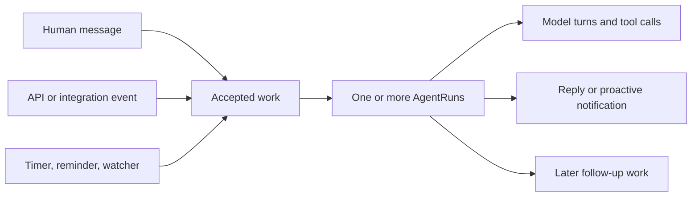

# Proactive personal-agent traffic comparables

Research date: 2026-08-02. Sources are official product pages, official
documentation, first-party source code, or interviews containing statements
from company principals.

## Conclusion

The public evidence does not establish that 20 messages per daily active user
is low or high. No identified comparable publishes a directionally complete,
DAU-normalized count that separates user messages, assistant replies, proactive
messages, API events, and internal work. Poke's public scale disclosures are not
sufficient to derive that number.

The evidence does show that a single `messages/user/day` input is too narrow for
capacity acceptance. Poke and Folk accept or create work from schedules,
watchers, integrations, programmatic events, and proactive follow-ups. OpenPoke
also demonstrates that one accepted input can create parallel execution agents,
multiple model turns, multiple tool calls, and a later interaction pass.

Therefore, 20 user-authored messages per DAU can remain an explicit planning
scenario, but it should not be the only accepted traffic model or be described
as comparable-validated. Capacity tests should independently model ingress
sources, run amplification, run duration, proactive egress, synchronized timer
bursts, and connected client sessions.



## What the comparables establish

| Comparable | Publicly supported workload shape | What remains unknown |
| --- | --- | --- |
| Poke | Apple Messages, Telegram, WhatsApp, and RCS; reminders; proactive use of integrations and memory; real-time background automations; API-triggered messages processed like user texts | Messages per DAU, direction split, trigger rate, fan-out distribution, run duration, concurrent users, and peaks |
| Folk | iMessage, Telegram, and WhatsApp; reminders, routines, follow-ups, interval watchers, morning briefs, phone calls, MCP tools, and an isolated computer per user | Users, messages per DAU, absolute plan limits, model/tool amplification, concurrency, and peaks |
| Stanley by Stan | Mobile and iMessage chat; multiple goal threads; daily nudges, reminders, checklists, habit tracking, daily content ideas, and weekly recaps | Messages per user, users or DAU attributable to Stanley, run fan-out, concurrency, and peaks |
| OpenPoke | Simplified open-source multi-agent architecture with parallel execution-agent delegation, triggers, an email watcher, iterative model/tool loops, and completion results routed back through the interaction agent | It is not production Poke and publishes no production traffic distribution or capacity results |

## Poke

Poke's official documentation identifies it as an assistant in Apple Messages,
Telegram, WhatsApp, and RCS. It manages email, calendars, reminders, web search,
and integrations. Its product page says it creates scheduled reminders,
proactively uses integrations and memory, and offers real-time background
automations with higher plan-dependent rate limits. See [Poke documentation](https://poke.com/docs)
and [Poke plans and automation description](https://poke.com/).

The official API makes non-human ingress explicit. API requests from desktop
tools, CI/CD, webhooks, monitoring, scheduled tasks, and other event-driven
workflows appear in the conversation and are processed as if the user had sent
a text. Its CRM example uses one API message to request an onboarding email, a
kickoff meeting, a Notion project, and 30, 60, and 90-day reminders. See
[Poke API](https://poke.com/docs/api).

Poke meters an unspecified usage allowance rather than publishing a message
count. Its documentation says demanding work may wait when the allowance is
exhausted and that heavy usage is often caused by automations firing very
frequently. See [Poke usage and resets](https://poke.com/docs/usage-and-resets).
This supports workload-sensitive cost and machine-driven traffic, not a fixed
messages-to-work ratio.

Poke also offers a concrete high-frequency proactive pattern. Its 75 program
lets a user choose check-ins and reminders throughout the day, sends daily
check-ins, and reminds the user about incomplete tasks. The page reports
"67,000+" participants, but it does not disclose active users or traffic, so
that number cannot be converted to load. See [Poke 75](https://poke.com/75).

Poke's terms say RCS message frequency varies with account activity and
preferences, and license its app on one or more user-owned devices. This
supports variable per-account output and multi-device access, but not two
simultaneously connected devices or SSE concurrency. See [Poke terms](https://poke.com/terms).

The strongest current scale disclosure is Cognition's July 2026 official
announcement welcoming Poke's maker. It says people exchanged more than 100
million messages with Poke in the prior three months and calls the product
beloved by hundreds of thousands of people. See [Cognition's announcement](https://cognition.com/blog/interaction).
That is more than 1.1 million bidirectional messages per average day, but it
still cannot be converted into accepted messages per DAU because neither
"people" nor "messages" is defined as an active-user denominator or an inbound
work counter.

An earlier September 2025 interview says Poke beta-tested with more than 6,000
users who collectively sent more than 200,000 messages each month. The article
also directly quotes co-founders Felix Schlegel and Marvin von Hagen about broad
conversational use. See the [Observer founder interview](https://observer.com/2025/09/startup-interaction-launch-ai-message-assistant/).
Neither scale disclosure can validate 20 messages per DAU per day because:

- the older denominator is beta participants, not DAU;
- the newer "hundreds of thousands" figure is not a precise user count or DAU;
- the figures are open-ended lower bounds;
- the newer count is explicitly bidirectional, while the older "messages"
  count does not define direction;
- neither provides an hourly distribution or peak; and
- the older disclosure predates the current automation, API, and product
  surface.

An early messaging-provider case study adds direct evidence about burst shape,
not a usable peak multiplier. It says Poke reached 10,000 messages in one day
within days of joining the provider, later grew by multiple orders of magnitude,
and experienced a sharp launch-day spike. It includes direct statements from
co-founder Felix Schlegel, but publishes neither the spike size nor a DAU or
direction split. See [Linq's Poke customer story](https://linqapp.com/blog/poke-customer-story).

## Folk

The product the user recalled as "Folk" is identifiable as Folk by Nozomio,
not the unrelated CRM with similar branding. Its official site describes a
personal AI in iMessage, Telegram, and WhatsApp that continues working in the
background, monitors conditions, sends morning briefings, completes tasks, and
texts when there is news. See [Folk's messaging use case](https://www.folk.com/use-cases/ai-assistant-in-imessage).

Folk documents three proactive input classes: scheduled reminders and routines,
interval-based watchers, and context-based decisions. Examples include morning
briefs, follow-ups conditional on another person's reply, price and flight
watchers, and phone calls for urgent reminders. It also says nudges should be
rate-limited. See [Folk's proactive-assistant explanation](https://www.folk.com/blog/can-an-ai-text-you-first-proactive-assistants-explained).

Folk's FAQ is particularly important for the load metric. It says each user has
an isolated sandbox, supports tools for coding, research, browsing, reminders,
and scheduling, and can add arbitrary MCP tools. It also meters plans by a
usage allowance rather than hard message count because quick chats consume far
less than long research, coding, or document work. See [Folk FAQ](https://www.folk.com/faq).
This is direct comparable evidence that accepted messages and computational
work cannot be linked by one constant multiplier across all request classes.

No first-party Folk source found publishes user count, DAU, message count,
concurrency, peaks, or absolute plan limits.

## Stanley by Stan

Stanley is identifiable as Stan's AI Head of Content. It is a narrower creator
coach, not a general personal assistant, but it is still relevant to proactive
and synchronized traffic. Its official App Store listing describes mobile and
iMessage access, multiple chat threads per goal, daily nudges, reminders,
checklists, habit tracking, and weekly recaps. See [Stanley's App Store listing](https://apps.apple.com/us/app/stanley-ai-head-of-content/id6754887783).

Stan says some creators use Stanley daily while others batch work weekly. In a
30-day campaign, 5,842 creators officially started a daily-posting challenge,
and Stanley was one of the promoted tools for daily ideas and accountability.
These figures describe a campaign cohort, not Stanley DAU or message volume.
They do, however, illustrate calendar-correlated daily work rather than smooth
Poisson traffic. See [Stanley usage patterns](https://stan.store/blog/12-ways-to-use-stanley/)
and [Dare to Post results](https://stan.store/blog/dare-to-post-2026/).

No first-party Stanley source found publishes messages per user, DAU, traffic
peaks, internal fan-out, or run duration.

## OpenPoke amplification evidence

OpenPoke explicitly calls itself a simplified open-source take on Poke, so its
code is architectural evidence, not production Poke telemetry. At revision
[`5b5f635`](https://github.com/shlokkhemani/openpoke/tree/5b5f635935a64ab37884c025d70abb0ed731c094):

- the README describes an interaction/execution multi-agent split, a trigger
  scheduler, and background watchers;
- the interaction prompt tells the model to split complicated tasks into as
  many concurrent execution-agent calls as possible;
- the interaction loop permits up to eight model/tool iterations;
- each execution agent independently permits up to eight model/tool iterations;
- execution-agent batches use a 90-second default timeout;
- due triggers launch execution agents, and the Gmail watcher can classify each
  eligible email before routing important results through another interaction
  pass.

See [README](https://github.com/shlokkhemani/openpoke/blob/5b5f635935a64ab37884c025d70abb0ed731c094/README.md),
[interaction prompt](https://github.com/shlokkhemani/openpoke/blob/5b5f635935a64ab37884c025d70abb0ed731c094/server/agents/interaction_agent/system_prompt.md),
[interaction loop](https://github.com/shlokkhemani/openpoke/blob/5b5f635935a64ab37884c025d70abb0ed731c094/server/agents/interaction_agent/runtime.py),
[execution loop](https://github.com/shlokkhemani/openpoke/blob/5b5f635935a64ab37884c025d70abb0ed731c094/server/agents/execution_agent/runtime.py),
[execution batch manager](https://github.com/shlokkhemani/openpoke/blob/5b5f635935a64ab37884c025d70abb0ed731c094/server/agents/execution_agent/batch_manager.py),
[trigger scheduler](https://github.com/shlokkhemani/openpoke/blob/5b5f635935a64ab37884c025d70abb0ed731c094/server/services/trigger_scheduler.py),
and [email watcher](https://github.com/shlokkhemani/openpoke/blob/5b5f635935a64ab37884c025d70abb0ed731c094/server/services/gmail/importance_watcher.py).

This does not prove that three AgentRuns per accepted message is wrong. It does
show why the mean alone is unsafe. Capacity acceptance needs the fan-out
distribution, loop depth, and duration distribution, including pathological
but bounded cases.

## Implications for the accepted traffic model

The existing arithmetic is internally consistent for the scenario stated:

```text
100,000 DAU * 20 user messages/day = 2,000,000 user messages/day
2,000,000 / 86,400 seconds = 23.15 average messages/second globally
23.15 * 10 peak ratio = 231.5 peak messages/second
231.5 * 3 AgentRuns/message = 694.4 AgentRun dispatches/second
694.4 * 20 seconds = 13,889 pending or executing AgentRuns at peak
```

The 23.15 value is global messages per second, not messages per user per
second. The arithmetic says nothing about whether the inputs match the product.

Replace the single causal chain with independently stated scenarios:

| Dimension | Required explicit inputs |
| --- | --- |
| Human ingress | DAU, user-authored messages per DAU, hourly shape, session burst size |
| Machine ingress | API events, integration webhooks, timers, watchers, and retries per active account |
| Proactive egress | Reminders, check-ins, alerts, intermediate updates, and completion messages per account |
| Run amplification | P50, P95, P99, and maximum root plus child AgentRuns per accepted work item |
| Work amplification | Model turns, tool calls, provider requests, external calls, and durable events per run |
| Duration | P50, P95, P99, and timeout by workload class, not one 20-second mean |
| Connection load | Simultaneously active accounts, devices per account, reconnect storms, and replay backlog |
| Correlation | Top-of-hour timers, morning briefs by timezone, campaigns, provider recovery, and webhook bursts |

The existing 700 dispatches/second and 10,000 SSE streams remain useful baseline
tests. The 2x burst is not enough as the only stress case. Add at least a
synchronized scheduled-work case, a heavy-tail fan-out case, a long-running
tool case, a reconnect/replay storm, and a dependency-recovery retry case.

## Evidence boundary

No approved primary source found answers the central quantitative question.
The comparables justify expanding the variables and load shapes, but not
choosing 20, 40, or any other messages-per-DAU number. That value should be
treated as a product hypothesis, then replaced with measured distributions from
instrumented beta traffic. Record user-originated input, machine-originated
input, user-visible output, internal runs, model turns, tool calls, duration,
and concurrency as separate counters so later observations can update the
model without changing its vocabulary.
