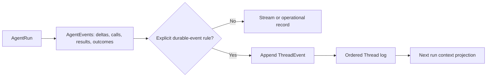

# Thread event comparables

Research date: 2026-07-31. Sources are official documentation or source code.

## Conclusion

The proposed split is sound and conventional: a `Thread` owns durable ordered
conversation history, while an `AgentRun` emits finer-grained runtime events.
Only completed semantic facts needed for later conversation, recovery, or audit
become `ThreadEvent`s.

**Assessment: 8.5/10 as stated; 9.5/10 if promotion is an explicit type rule.**
The weak point is the word "meaningful." It must not be a subjective decision
made during each run. Define which completed `AgentEvent` types produce which
`ThreadEvent` types. A reply is one possible result of a run, not the definition
of an `AgentEvent`.



## Comparable systems

### OpenAI Conversations and Agents SDK

OpenAI's Conversations API models a conversation as a long-running object with
a durable identifier that can be reused across sessions, devices, and jobs. It
stores heterogeneous items including messages, tool calls, and tool outputs.
This closely matches `Thread -> ThreadEvent`, although OpenAI calls the durable
records "items." Items can be listed in an explicit order and paged after an
item identifier. See [conversation state](https://developers.openai.com/api/docs/guides/conversation-state)
and [list conversation items](https://developers.openai.com/api/reference/resources/conversations/subresources/items/methods/list).

The Agents SDK makes the runtime/durable split particularly clear:

- Raw stream events include token deltas.
- Higher-level run-item events report completed messages, tool calls, and tool
  outputs.
- Sessions store the new user input and completed items generated during a run,
  then retrieve that history for the next run.

See [streaming](https://openai.github.io/openai-agents-python/streaming/) and
[sessions](https://openai.github.io/openai-agents-python/sessions/).

### LangGraph

LangGraph is checkpoint-oriented rather than a pure conversational event log.
Its checkpointer persists graph-state snapshots under a thread identifier,
supporting later interactions, failure recovery, state history, and replay.
Streaming separately exposes tokens, state updates, tasks, checkpoints, custom
progress, and debug data. This validates the conceptual split even though the
storage shape differs from Osfo's proposed append-only log.

LangGraph also separates thread-scoped conversational state from cross-thread
long-term memory. See [persistence](https://docs.langchain.com/oss/python/langgraph/persistence),
[streaming](https://docs.langchain.com/oss/python/langgraph/streaming), and
[memory](https://docs.langchain.com/oss/python/langgraph/add-memory).

### Temporal

Temporal's Event History is a complete ordered source of truth for reconstructing
workflow state, but Temporal does not turn every runtime occurrence into a
history event. Activity results are recorded for replay; retry chatter,
heartbeats, and metrics are handled differently. That is strong precedent for
persisting semantic transitions rather than every emitted update.

See [Event History](https://docs.temporal.io/workflow-execution/event),
[History Service architecture](https://github.com/temporalio/temporal/blob/main/docs/architecture/history-service.md),
and the official documentation's [replay explanation](https://github.com/temporalio/documentation/blob/5ab53ef44faa41e34fd03068551266934f3de81c/fixtures/static/encyclopedia/workflows.md#how-workflow-replay-works).

### OpenPoke

OpenPoke provides a useful local predecessor, not the target architecture. It
keeps an append-only conversation file and a second working-memory file holding
a summary plus recent unsummarized entries. The full conversation log is the
source for rebuilding the smaller working set. See its
[conversation log](https://github.com/shlokkhemani/openpoke/blob/5b5f635935a64ab37884c025d70abb0ed731c094/server/services/conversation/log.py),
[working-memory log](https://github.com/shlokkhemani/openpoke/blob/5b5f635935a64ab37884c025d70abb0ed731c094/server/services/conversation/summarization/working_memory_log.py),
and [summarizer](https://github.com/shlokkhemani/openpoke/blob/5b5f635935a64ab37884c025d70abb0ed731c094/server/services/conversation/summarization/summarizer.py).

Osfo's proposed typed, per-Thread sequence is a cleaner scalable form of this
idea because it gives reconstruction, pagination, deduplication, and audit a
stable semantic boundary instead of relying on file position and display tags.

## Recommended model

```text
ThreadEvent log
  immutable, per-Thread ordered conversational facts
              |
              v
Context projection
  latest versioned compaction + recent selected events
              |
              v
AgentRun
  emits detailed AgentEvents; explicit types append new ThreadEvents
```

Adopt these guardrails:

1. Treat messages as one `ThreadEvent` payload family, not as the whole event
   model. Tool results, workflow outcomes, approvals, failures, and cancellations
   may also be durable conversational facts.
2. Translate a completed `AgentEvent` into a new `ThreadEvent`; do not merely
   relabel the same object. Preserve correlation and causation identifiers.
3. Do not append token deltas, connection changes, heartbeats, retries, or
   provider telemetry to the canonical Thread log.
4. Keep compaction as a versioned, rebuildable context projection. Do not delete
   or rewrite the canonical source events.
5. Feed the next run the projection required by policy, not necessarily the
   entire raw log. This keeps the durable history complete without making prompt
   size or replay cost grow without bound.

The model is therefore simple in semantics and scalable in operation: one
authoritative sequence per Thread, a separate detailed run stream, and a bounded
derived context for model calls.
